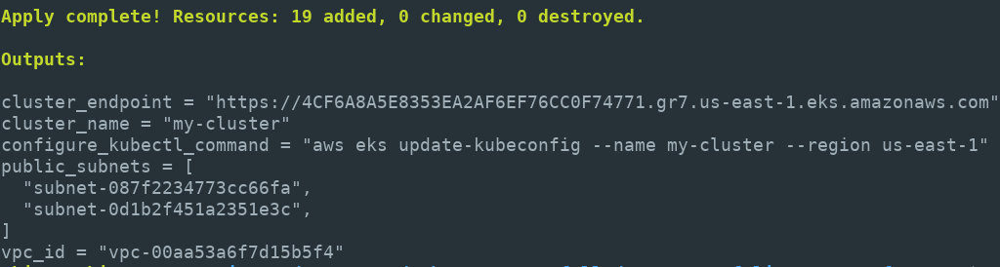
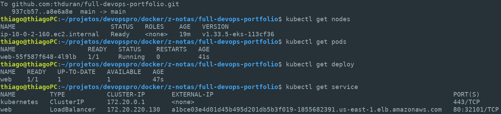
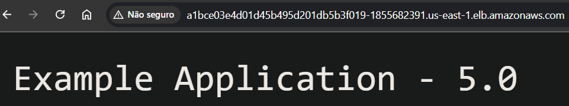

[english below]

# Projeto de Portfólio DevOps: Pipeline Completo de IaC e CI/CD com EKS

Este projeto de portfólio demonstra um ciclo de vida DevOps de ponta a ponta. O objetivo é provisionar uma infraestrutura completa na AWS usando Terraform (IaC) e, em seguida, implantar automaticamente uma aplicação web em um pipeline de CI/CD usando GitHub Actions.

O foco não é apenas o resultado final, mas a jornada de construção e depuração.

## Índice

* [Visão Geral do Projeto](#10-visão-geral-do-projeto)
* [Arquitetura](#20-arquitetura)
* [Tecnologias Utilizadas](#30-tecnologias-utilizadas)
* [Decisões Chave de Arquitetura](#40-decisões-chave-de-arquitetura)
* [Como Executar Este Projeto](#50-como-executar-este-projeto)
* [Imagens do Projeto Rodando](#60-imagens-do-projeto-rodando)
* [A Jornada: Relatório Completo de Aprendizado e Debug](#a-jornada-relatório-completo-de-aprendizado-e-debug)
* [Referência Rápida de Comandos](#referência-rápida-de-comandos)

---

## 1.0 Visão Geral do Projeto

O fluxo é dividido em duas fases principais:

Fase 1: Infraestrutura como Código (IaC)
* Um desenvolvedor executa `terraform apply` localmente.
* O Terraform provisiona uma rede (VPC), um cluster Kubernetes gerenciado (EKS), permissões (IAM) e os worker nodes (EC2) na AWS.

Fase 2: Pipeline de CI/CD
* Um `git push` para a branch main dispara um workflow do GitHub Actions.
* CI (Integração Contínua): O pipeline testa, compila, constrói uma imagem Docker e a envia para um registro.
* CD (Entrega Contínua): O pipeline se autentica no cluster EKS (criado pelo Terraform) e usa `kubectl apply` para implantar a nova versão da aplicação, que é exposta ao público por um Load Balancer.

## 2.0 Arquitetura

A arquitetura deste projeto é dividida em três fluxos principais: o Fluxo de Provisionamento de Infraestrutura (IaC), o Fluxo de Implantação de Aplicação (CI/CD) e o Fluxo de Tráfego do Usuário.

a. Fluxo de Provisionamento (IaC com Terraform)

Este fluxo é executado uma vez, manualmente, para construir o "terreno" onde a aplicação vai rodar.

* Tudo começa com o `terraform apply`.
* O Terraform lê os arquivos `.tf` e se comunica com a AWS.
* O `vpc.tf` cria a rede, usando o módulo `terraform-aws-modules/vpc/aws`. Crucialmente, ele é configurado para criar apenas sub-redes públicas (`private_subnets = []`) e desabilitar o NAT Gateway (`enable_nat_gateway = false`). Esta é uma decisão de arquitetura focada em custo zero para o projeto.
* O `iam.tf` cria duas "identidades" (Roles) essenciais: uma para o Control Plane do EKS (para que ele possa gerenciar redes) e outra para os Worker Nodes (para que eles possam se registrar no cluster e baixar imagens).
* O `eks.tf` cria o aws_eks_cluster (o "cérebro" gerenciado pela AWS) e o aws_eks_node_group (o "músculo", nossa instância t3.small).

b. Fluxo de Implantação (CI/CD com GitHub Actions)

Este fluxo é 100% automatizado e acontece a cada `git push` na branch main.

* O Job de CI é acionado. Ele baixa o código, executa testes, constrói a imagem Docker e a envia para o Docker Hub com uma nova tag.
* O Job de CD começa. Ele usa os secrets (AWS_ACCESS_KEY_ID) para se autenticar na AWS.
* Ele então executa o comando `aws eks update-kubeconfig` para se conectar ao cluster EKS que o Terraform criou.
* Finalmente, ele executa `kubectl apply` nos manifestos (ex: deployment.yaml, service.yaml) para implantar ou atualizar a aplicação no cluster.

c. Fluxo de Tráfego do Usuário (Kubernetes)

Este é o fluxo de como um usuário final acessa a aplicação.

* O `kubectl apply` criou um Service do tipo LoadBalancer.
* Como não instalamos um "AWS Load Balancer Controller" (o que seria uma arquitetura mais avançada), o EKS por padrão provisiona um Classic Load Balancer (ELBv1).
* O ELB é público (porta 80), mas ele não se conecta diretamente ao Pod.
* O ELB encaminha o tráfego para uma porta alta e aleatória no nó EC2. Essa porta é a NodePort (ex: 32522), que é definida pelo serviço do Kubernetes.
* Um processo chamado kube-proxy (que roda em todos os nós) intercepta o tráfego na porta (ex: 32522) e o roteia para o IP interno e porta do Pod (ex: 10.0.2.75:5000).
* (Esta arquitetura de NodePort foi a razão do nosso debug: ela exige a abertura manual dessa porta (ex. 32522) no Security Group (firewall) da instância EC2 para que o Load Balancer possa acessá-la.)

## 3.0 Tecnologias Utilizadas

* Nuvem: AWS (EKS, EC2, VPC, IAM, ELB)
* IaC: Terraform
* CI/CD: GitHub Actions
* Orquestração: Kubernetes
* Containers: Docker

## 4.0 Decisões Chave de Arquitetura

Por que Terraform?
* Para garantir que a infraestrutura seja 100% reprodutível, versionável e fácil de destruir. Evita o "ClickOps" (criar manualmente no console), que é propenso a erros.

Por que essa arquitetura de VPC (Sem Sub-redes Privadas)?

* Custo e simplificação do projeto. A arquitetura de produção padrão usa private subnets para nós e um NAT Gateway para acesso à internet.
* Um NAT Gateway custa aproximadamente $0.045/h (aproximadamente $33/mês), ligado ou não.
* Ação: Usamos `private_subnets = []` e `enable_nat_gateway = false`. Colocamos nossos nós em public_subnets com `map_public_ip_on_launch = true`.
* Trade-off: Sacrificamos a segurança de produção (nós não estão isolados) em troca de custo zero de rede e simplificação.

Por que o iam.tf é necessário?
* O EKS é um "serviço de serviços". O Control Plane precisa de uma role (IAM) para gerenciar redes (VPC), e os Nós (EC2) precisam de outra role para se registrar no cluster e baixar imagens (ECR). O iam.tf define essas identidades e permissões obrigatórias.

Por que o pipeline de CD usa as credenciais do admin do Terraform?
* O EKS tem dois sistemas de permissão: IAM (AWS) e RBAC (Kubernetes).
* Por padrão, apenas o usuário IAM que criou o cluster é adicionado ao RBAC do Kubernetes como system:masters (admin).
* Ação: Usamos as credenciais do mesmo usuário IAM do Terraform nos secrets do GitHub (AWS_ACCESS_KEY_ID).
* Trade-off: É a forma mais simples de garantir que o pipeline tenha permissão de deploy sem precisar configurar manualmente o ConfigMap aws-auth.

## 5.0 Como Executar Este Projeto

### Pré-requisitos

1. Uma conta AWS com credenciais (Access Key ID e Secret Key) de um usuário com permissões de administrador.
2. Terraform CLI instalado.
3. AWS CLI instalado e configurado (aws configure).
4. kubectl instalado. 
5. Um fork deste repositório no seu GitHub. 
6. Uma conta no Docker Hub.

### 5.1 Provisionar a Infra (Terraform)

No diretório raiz do projeto:

```bash
# 1. (Opcional) Edite o terraform.tfvars com seus valores
# vim terraform.tfvars

# 2. Inicializa o Terraform e baixa os módulos
terraform init

# 3. (Opcional) Vê o que será criado
terraform plan

# 4. Aplica e cria os recursos na AWS. (Pode levar de 15-20 minutos)
terraform apply -auto-approve
```

### 5.2 Configurar os Secrets do GitHub

No seu repositório GitHub, vá em Settings > Secrets and variables > Actions e crie os seguintes secrets:

* AWS_ACCESS_KEY_ID: A Access Key da AWS (mesmo usuário do Terraform).
* AWS_SECRET_ACCESS_KEY: A Secret Key correspondente.
* DOCKERHUB_USERNAME: Seu nome de usuário do Docker Hub.
* DOCKERHUB_TOKEN: Um Access Token (não sua senha) gerado no Docker Hub.

Importante: Você também precisará alterar o pipeline (e/ou k8s/deployment.yaml) para apontar para o seu repositório do Docker Hub (ex: seunome/minha-app:latest).

### 5.3 Executar o Pipeline (CI/CD)

Faça qualquer alteração pequena no código (ex: adicionar um espaço no README.md) e envie para a branch main.

```bash
git commit -m "Trigger pipeline" --allow-empty
git push origin main 
```

Vá até a aba "Actions" do seu repositório no GitHub para assistir o pipeline rodar.

### 5.4 Testar e Verificar o Deploy

Após o pipeline de CD ser concluído:

#### 5.4.1 Configure seu kubectl local (o comando de saída do Terraform):

```bash
# Use os valores do seu .tfvars
aws eks update-kubeconfig --name my-cluster --region us-east-1
```

#### 5.4.2 Verifique se os Nós e Pods estão prontos:

```bash
kubectl get nodes
# DEVE MOSTRAR: STATUS Ready 
kubectl get pods
# DEVE MOSTRAR: STATUS Running (pode levar um minuto)
```

#### 5.4.3 Encontre o IP do Load Balancer:

```bash
kubectl get service
# Procure pelo seu serviço (ex: "web")
# Copie o valor do campo "EXTERNAL-IP" (ex: a66d....elb.amazonaws.com)
```

#### 5.4.4 Acesse o IP no navegador: Cole o endereço EXTERNAL-IP no seu navegador. A aplicação deve carregar.

Solução de Problemas (Se NÃO carregar)
* Se o site não carregar mesmo com o Pod Running, isso geralmente é causado pelo firewall (Security Group) bloqueando a NodePort (uma porta aleatória, ex: 32522).
1. Encontre sua NodePort com `kubectl describe service web`.
2. Vá em EC2 > Security Groups e adicione uma Inbound Rule para esta porta (ex: 32522) com origem 0.0.0.0/0.

Para a explicação detalhada de como este problema foi diagnosticado, veja a seção Parte 3 abaixo.

## 6.0 Imagens do projeto rodando

Construção com sucesso do Terraform e outputs com comando para configurar o kubeconfig


Serviços do Kubernetes no ar apenas após o push que acionou o pipeline de deploy


Acessando IP do LoadBalancer no navegador


### 7.0 Limpeza (!)
AVISO: O EKS e o Load Balancer são cobrados por hora.

#### 7.1 DESTRUA O LOAD BALANCER (Dependência)
* AVISO: Antes de rodar terraform destroy, você DEVE excluir o Load Balancer criado pelo Kubernetes.
Se você não fizer isso, o Terraform falhará com um erro de DependencyViolation.

Para a explicação detalhada deste erro, veja Parte 4 abaixo.

#### 7.2 DESTRUA A INFRA (Terraform)

```bash
terraform destroy -auto-approve
```

---

## A Jornada: Relatório Completo de Aprendizado e Debug

Esta seção é um log de tudo o que foi aprendido durante a construção deste projeto, focado nos erros e como eles foram resolvidos.

### Parte 1: Estratégia de Custo e Provisionamento
* Objetivo: Criar um cluster EKS com custo mínimo.
* Decisão: Evitar o NAT Gateway. Isso nos forçou a usar public_subnets para os worker nodes.

#### Empecilho 1: Ec2SubnetInvalidConfiguration (Erro de Lógica)
* Erro: O terraform apply falhou na criação do aws_eks_node_group com o erro does not automatically assign public IP addresses.
* Causa: Colocamos o nó em uma sub-rede pública, mas esquecemos de dizer à sub-rede para dar um IP público ao nó. Sem isso, o nó não podia se comunicar com o control plane do EKS.
* Solução: Adicionar `map_public_ip_on_launch = true` ao módulo vpc no arquivo vpc.tf.

### Parte 2: O Desafio da Modularização vs. Projeto Plano

#### Empecilho 2: Reference to undeclared resource (Erro de Referência)
* Erro: A managed resource "vpc" "public_subnets" has not been declared...
* Causa: Dentro do nosso código, estávamos referenciando vpc.public_subnets (como se fosse um projeto plano), mas o recurso VPC estava dentro de um módulo.
* Solução: Corrigir todas as referências para o formato de módulo: vpc.public_subnets -> module.vpc.public_subnets aws_eks_cluster.cluster_name (no outputs.tf da raiz) -> module.my-eks.cluster_name
* (Nota: Mais tarde, simplificamos de volta para um projeto plano/híbrido, e as referências tiveram que ser ajustadas novamente para module.vpc.public_subnets e aws_eks_cluster.eks_cluster.name.)

#### Empecilho 3: EntityAlreadyExists (Erro de Timing da AWS)
* Erro: Ao rodar terraform apply após um destroy falho, a criação das IAM Roles falhou com StatusCode: 409, EntityAlreadyExists.
* Causa: A AWS IAM tem "consistência eventual". O destroy removeu a role, mas a AWS ainda não tinha processado a exclusão totalmente quando tentamos recriá-la com o mesmo nome.
* Solução (Simplista): Esperar 1-2 minutos e rodar apply de novo.
* Solução (Correta): Usar `name_prefix = "..."` em vez de `name = "..." no iam.tf`. Isso faz o Terraform gerar um nome único com um sufixo aleatório, evitando a colisão.

### Parte 3: O "Debug Final" do Load Balancer
* Sintoma: O pipeline rodou. `kubectl get pods` mostrava Running 1/1. `kubectl get service` mostrava um EXTERNAL-IP (Load Balancer). Mas o site não carregava no navegador (timeout).

#### Pista 1: port-forward funcionou!
* `kubectl port-forward pod/web-1234 8080:5000` (porta do app era 5000).
* Acessar http://localhost:8080 funcionou.
* Diagnóstico: Isso provou que o Pod e a aplicação estavam 100% saudáveis. O problema estava na rede (entre o Load Balancer e o Pod).

#### Pista 2: Não existe "Target Group".
* No Console da AWS, fomos ao EC2 > Target Groups, mas estava vazio.
* Diagnóstico: Um Service tipo LoadBalancer padrão no EKS (sem o "AWS Load Balancer Controller" instalado) não cria um Application Load Balancer (ALB). Ele cria um Classic Load Balancer (ELBv1).

#### A Revelação (O Fluxo Real do ELBv1):

1. O tráfego da Internet chega ao ELB pela porta 80.
2. O ELB não envia para o Pod. Ele envia para a NodePort no nó EC2.
3. Usamos `kubectl describe service web` para encontrar a NodePort (ex: 32522).
4. O kube-proxy (no nó) roteia o tráfego da porta 32522 para a porta 5000 do Pod.
O Problema Real: O Security Group (firewall) do nosso nó EC2 (t3.small) estava bloqueando a porta 32522!

#### A Solução Final:
1. No Console da AWS > EC2 > Security Groups, encontrar o SG do worker node.
2. Editar as Inbound Rules.
3. Adicionar uma nova regra: Tipo: TCP Personalizado, Porta: 32522 (ou qualquer que seja sua NodePort), Origem: 0.0.0.0/0 (Qualquer lugar).
4. Assim que salvamos, o status do nó no ELB (aba "Instances") mudou para InService e o site carregou.

### Parte 4: A Falha ao Destruir (DependencyViolation)
* Erro: terraform destroy falhou com Error: deleting EC2 Subnet ... DependencyViolation.
* Causa: O Load Balancer (ELBv1) ainda estava usando as sub-redes. O Terraform não podia excluir algo com uma dependência ativa.
* Aprendizado: O Terraform não gerencia recursos criados pelo Kubernetes.
* Solução (Obrigatória): Sempre excluir os Service do tipo LoadBalancer do Kubernetes ANTES de destruir a infra do Terraform.
1. `kubectl delete service web`
2. Aguardar 2 minutos.
3. `terraform destroy -auto-approve`

---

## Referência Rápida de Comandos

AWS CLI

Configura o kubectl

```bash
aws eks update-kubeconfig --name <cluster-name> --region <region>
```

Kubectl (Debug)

```bash
# Verifica o status dos nós
kubectl get nodes
# Verifica o status dos pods
kubectl get pods
# Verifica o status dos serviços e encontra o IP 
kubectl get service
# (O "Debug Mestre") Testa o pod diretamente
kubectl port-forward pod/<nome-do-pod> [porta-local]:[porta-container]
# Vê os logs da aplicação se ela estiver quebrando
kubectl logs <nome-do-pod>
# O comando que revela a NodePort e os Selectors
kubectl describe service <nome-do-servico>
# O comando para "destravar" o terraform destroy 
kubectl delete service <nome-do-servico>
```

---

[english]

# DevOps Portfolio Project: Full IaC and CI/CD Pipeline with EKS

DevOps Portfolio Project: Full IaC and CI/CD Pipeline with EKS

This portfolio project demonstrates an end-to-end DevOps life cycle. The objective is to provision a complete infrastructure on AWS using Terraform (IaC) and then automatically deploy a web application via a CI/CD pipeline using GitHub Actions.

The focus is not just on the final result, but on the build and debugging journey.

## Index

* [Project Overview](#10-project-overview)
* [Architecture](#20-architecture)
* [Tecnologies Used](#30-technologies-used)
* [Key Decisions on Architecture](#40-key-decisions-on-architecture)
* [How to run it](#50-how-to-run-it)
* [Images of the Project running](#60-images-of-the-project-running)
* [The journey: Complete report of learning and Debugging](#the-journey-complete-report-of-learning-and-debugging)
* [Quick Command Reference](#quick-command-reference)

---

## 1.0 Project Overview

The flow is divided into two main phases:

Phase 1: Infrastructure as Code (IaC)
* A developer runs `terraform apply` locally.
* Terraform provisiona a network (VPC), a managed Kubernetes cluster (EKS), permissions (IAM) and the worker nodes (EC2) in AWS.

Phase 2: CI/CD Pipeline
* `git push` for the main branch triggers a GitHub Actions workflow.
* CI: The pipeline tests, compiles, builds a Docker image and sends it to a registry.
* CD: The pipeline authenticates to the EKS cluster (created by Terraform) and uses `kubectl apply` to implant the new app version, which is exposed to the public by a Load Balancer.

## 2.0 Architecture

It is divided into three main flows: the Infrastructure Provisioning Flow (IaC), the Application Deployment Flow (CI/CD) and the User Traffic Flow.

a. Infrastructure Provisioning Flow (IaC with Terraform)

This flow is run once, manually, to build the environment where the app will run.

* It all begins with `terraform apply`.
* Terraform reads the `.tf` files and communicates with AWS.
* The `vpc.tf` creates the network, using `terraform-aws-modules/vpc/aws` module. Crucially, it is configured to create only public subnets (`private_subnets = []`) and disable the NAT Gateway (`enable_nat_gateway = false`). This is an architectural decision focused on a zero-cost project.
* `iam.tf` creates 2 essential "identities" (Roles): one for the EKS Control Plane (so it can manage networks) and another for the Worker Nodes (so they can register with the cluster and pull images).
* `eks.tf` creates aws_eks_cluster (the "brain" managed by AWS) and aws_eks_node_group (the "muscle", our t3.small instance).

b. Application Deployment Flow (CI/CD with GitHub Actions)

It is 100% automated and happens on each `git push` to the main branch.

* The CI job is triggerd. It pulls the code, run tests, builds the Docker image and sends it to the Docker Hub with a new tag.
* The CD Job begins. It uses secrets (AWS_ACCESS_KEY_ID) for AWS authentication.
* Then, it runs `aws eks update-kubeconfig` command to connect to the EKS cluster that Terraform created.
* Finally, it runs `kubectl apply` on the manifests (e.g. deployment.yaml, service.yaml) to deploy or update the app in the cluster.

c. User Traffic Flow (Kubernetes)

This is how an end-user accesses the app.

* `kubectl apply` creates a LoadBalancer service.
* Since we didn't install an "AWS Load Balancer Controller" (a more advanced architecture), EKS, provisions a Classic Load Balancer (ELBv1) by default.
* ELB is public (port 80), but it does not connect directly to the Pod.
* ELB sends the traffic to a high, random port on the EC2 node. This port is the NodePort (e.g 32522), which is set by the Kubernetes service.
* A process called  kube-proxy (which runs on all nodes) intercepts the traffic at that port (e.g 32522) and routes it to the internal IP and Pod port (e.g 10.0.2.75:5000).
* (This NodePort architecture was the reason for our debug: it requires this port to be manually opened in the EC2 instance's Security Group (firewall) so the Load Balancer can access it.)

## 3.0 Technologies Used

* Cloud: AWS (EKS, EC2, VPC, IAM, ELB)
* IaC: Terraform
* CI/CD: GitHub Actions
* Orchestration: Kubernetes
* Containers: Docker

## 4.0 Key Decisions on Architecture

Why Terraform?
* To ensure the infrastructure is 100% reproducible, versionable and easy to destroy. It prevents "Clickops" (manual console operations), which is error-prone.

Why this VPC architecture (without private subnets)?

* Cost and project simplification. Standard production-level architectures use private subnets for nodes and a NAT Gateway for internet access.
* A NAT Gateway costs ~$0.045/h (~$33/month), whether it's on or not.
* Action: We used `private_subnets = []` and `enable_nat_gateway = false`. We put the nodes in public_subnets with `map_public_ip_on_launch = true`.
* Trade-off: We sacrificed production security (nodes are not isolated) in exchange for simplicity and zero network cost.

Why iam.tf is necessary?
* EKS is a "service of services". The Control Plane needs a role (IAM) to manage networks (VPC), and the Nodes (EC2) need another role to register with the cluster and pull images (ECR). The iam.tf defines these mandatory identities and permissions.

Why the CD pipeline uses the Terraform admin credentials?
* EKS has 2 permission systems: IAM (AWS) and RBAC (Kubernetes).
* By default, only the IAM user who created the cluster is added to the Kubernetes RBAC as system:masters (admin).
* Action: The credentials of the same Terraform IAM user are used in the GitHub secrets (AWS_ACCESS_KEY_ID).
* Trade-off: It is the simplest way to ensure the pipeline has deploy permissions without manually configuring the aws-auth ConfigMap.

## 5.0 How to run it

Prerequisites

1. An AWS account with credentials (Access Key ID and Secret Key) of a user with admin permissions.
2. Terraform CLI installed.
3. AWS CLI installed and configured (aws configure).
4. kubectl installed. 
5. A fork of this repo - GitHub. 
6. A Docker Hub account.

### 5.1 Provision the Infra (Terraform)

In the root directory:

```bash
# 1. (Optional) Edit terraform.tfvars with your values
# vim terraform.tfvars

# 2. Initialize Terraform and pull modules
terraform init

# 3. (Optional) See what will be created
terraform plan

# 4. Applies and creates resources in AWS. (15-20 minutes)
terraform apply -auto-approve
```

### 5.2 Configuring GitHub Secrets

In your repo, go to Settings > Secrets and variables > Actions and create the following secrets:

* AWS_ACCESS_KEY_ID: AWS Access Key (same as Terraform user).
* AWS_SECRET_ACCESS_KEY
* DOCKERHUB_USERNAME
* DOCKERHUB_TOKEN: an Access Token (not your password) generated on Docker Hub.

Important: You'll also need to edit the pipeline (and/or k8s/deployment.yaml) to point to your Docker Hub repo (ex: yourname/my-app:latest).

### 5.3 Run the Pipeline (CI/CD)

Make any small change to the code (e.g add a space in README.md) and push to main branch.

```bash
git commit -m "Trigger pipeline" --allow-empty
git push origin main 
```

Go to the "Actions" tab to watch it run.

### 5.4 Test and Check Deploy

After the CD pipeline is finished:

#### 5.4.1 Configure your local kubectl (using Terraform output):

```bash
# Use the values of your .tfvars
aws eks update-kubeconfig --name my-cluster --region us-east-1
```

#### 5.4.2 Check if the Nodes and Pods are ready:

```bash
kubectl get nodes
# MUST DISPLAY: STATUS Ready 
kubectl get pods
# MUST DISPLAY: STATUS Running (~1min)
```

#### 5.4.3 Get the Load Balancer IP:

```bash
kubectl get service
# Look for "web" service
# Copy the "EXTERNAL-IP" (ex: a66d....elb.amazonaws.com)
```

#### 5.4.4 Accessing: Paste the EXTERNAL-IP into your browser. The applications should load.

Troubleshooting (if it doesn't load)
* If the website doesn't load even though the Pod is Running, this is usually caused by the firewall (Security Group) blocking the NodePort (a random port, e.g 32522).
* Solution: You must add an Inbound Rule to your EC2 Node's Security Group to allow traffic on the NodePort (e.g., 32522) from all sources (0.0.0.0/0).

For a detailed explanation of how this problem was diagnosed (including how to find your NodePort), see Part 3 in the "Journey" section below.

## 6.0 Images of the Project running

Succeded Terraform building and outputs with command to set kubeconfig


Kubernetes services up only after push that triggered the deploy pipeline


Acessing LoadBalancer IP


### 7.0 Cleanup (!)
Warning: EKS and the Load Balancer are charged by the hour.

#### 7.1 DESTROY THE LOAD BALANCER (Dependency)
* WARNING: before running terraform destroy, you MUST delete the Load Balancer created by Kubernetes.
If you don't do this, Terraform will fail with a DependencyViolation error.

For a detailed explanation of this error, see Part 4 in the "Journey" section below.

---

## The journey: Complete Report of Learning and Debugging

This section is a "log" of everything I learned during this project's construction, focusing on errors and how they were solved.

### Part 1:  Cost Strategy and Provisioning
* Goal: Create an EKS cluster with minimum cost.
* Decision: Avoid NAT Gateway. This forced the use of public_subnets for the worker nodes.

#### Obstacle 1: Ec2SubnetInvalidConfiguration (Logic Error)
* Error: `terraform apply` failed during the creation of aws_eks_node_group with the error "does not automatically assign public IP addresses".
* Cause: The node was placed in a public subnet, but we forgot to tell the subnet to give the node a public IP. Without it, the node couldn't communicate with the EKS control plane.
* Solution: Add `map_public_ip_on_launch = true` to the vpc module in vpc.tf file.

### Part 2: Modularization challenge vs. Flat Project

#### Obstacle 2: Reference to undeclared resource (Reference Error)
* Error: A managed resource "vpc" "public_subnets" has not been declared...
* Cause: Inside our code, vpc.public_subnets was being referenced (as if it were a flat project), but the VPC resource was inside a module.
* Solution: Correct all references to the module format: vpc.public_subnets -> module.vpc.public_subnets aws_eks_cluster.cluster_name (in outputs.tf) -> module.my-eks.cluster_name
* (Note: Later, we simplified back to a more flat project, and the references had to be adjusted again to module.vpc.public_subnets and aws_eks_cluster.eks_cluster.name)

#### Obstacle 3: EntityAlreadyExists (AWS Timing Error)
* Error: When running `terraform apply` after a failed destroy, the IAM Role creation failed with StatusCode: 409, EntityAlreadyExists.
* Cause: AWS IAM is "eventually consistent". The destroy removed the role, but AWS hadn't fully processed the deletion when I tried to recreate it with the same name.
* Soluion (Simpler): Wait 1-2 minutes and run apply again.
* Solution (Correct): Use `name_prefix = "..."` instead of `name = "..."` in iam.tf. This makes Terraform generate a unique name with a random sufix, preventing the collision.

### Part 3: The "Final Debug" of Load Balancer
* Symptom: The pipeline finished. `kubectl get pods` showed Running 1/1. `kubectl get service` showed an EXTERNAL-IP (Load Balancer), but the app wasn't loading in the browser (timeout).

#### Clue 1: port-forward worked!
* `kubectl port-forward pod/web-1234 8080:5000` (app port is 5000).
* Accessing http://localhost:8080 worked.
* Diagnosis: This proved the Pod and the application were 100% healthy. The problem was in the network (between the Load Balancer and the Pod).

#### Clue 2: non-existing "Target Group".
* EC2 > Target Groups was empty.
* Diagnosis: A standard LoadBalancer service in EKS (without the "AWS Load Balancer Controller" installed) doesn't create an Application Load Balancer (ALB). It creates a Classic Load Balancer (ELBv1).

#### The revelation (Real Flow of ELBv1):

1. Internet traffic comes to the ELB on port 80.
2. ELB doesn't send it to the Pod. It sends it to the NodePort on the EC2 node.
3. We used `kubectl describe service web` to find the NodePort (e.g 32522).
4. The kube-proxy (on the node) routes the traffic from port 32522 to port 5000 of the Pod.
The Real Problem: The Security Group (firewall) of our EC2 node (t3.small) was blocking port 32522!

#### The Final Solution:
1. At EC2 > Security Groups, find the worker node's SG.
2. Edit the Inbound Rules.
3. Add a new rule: Type: Custom TCP, Port: 32522 (or any other), Source: 0.0.0.0/0.
4. As soon I saved it, the node's status in the ELB ("Instances" tab) changed to InService and the browser loaded the app.

### Part 4: Failed to Destroy (DependencyViolation)
* Error: terraform destroy failed with Error: deleting EC2 Subnet ... DependencyViolation.
* Cause: The Load Balancer (ELBv1) was still using the subnets. Terraform couldn't delete something with an active dependency.
* Learned: Terraform doesn't manage resources created by Kubernetes.
* Solution (Mandatory): Always delete LoadBalancer services from Kubernetes before destroying Terraform infra.
1. `kubectl delete service web`
2. Wait 2 minutes.
3. `terraform destroy -auto-approve`

---

## Quick Command Reference

AWS CLI

Configuring kubectl

```bash
aws eks update-kubeconfig --name <cluster-name> --region <region>
```

Kubectl (Debug)

```bash
# Check nodes' status
kubectl get nodes
# Check pods' status
kubectl get pods
# Check services' status and finds the IP 
kubectl get service
# Test the pod directly
kubectl port-forward pod/<nome-do-pod> [local-port]:[container-port]
# Check app logs if it's crashing
kubectl logs <nome-do-pod>
# Command that reveals NodePort and Selectors
kubectl describe service <service-name>
# Command to "unlock" terraform destroy 
kubectl delete service <service-name>